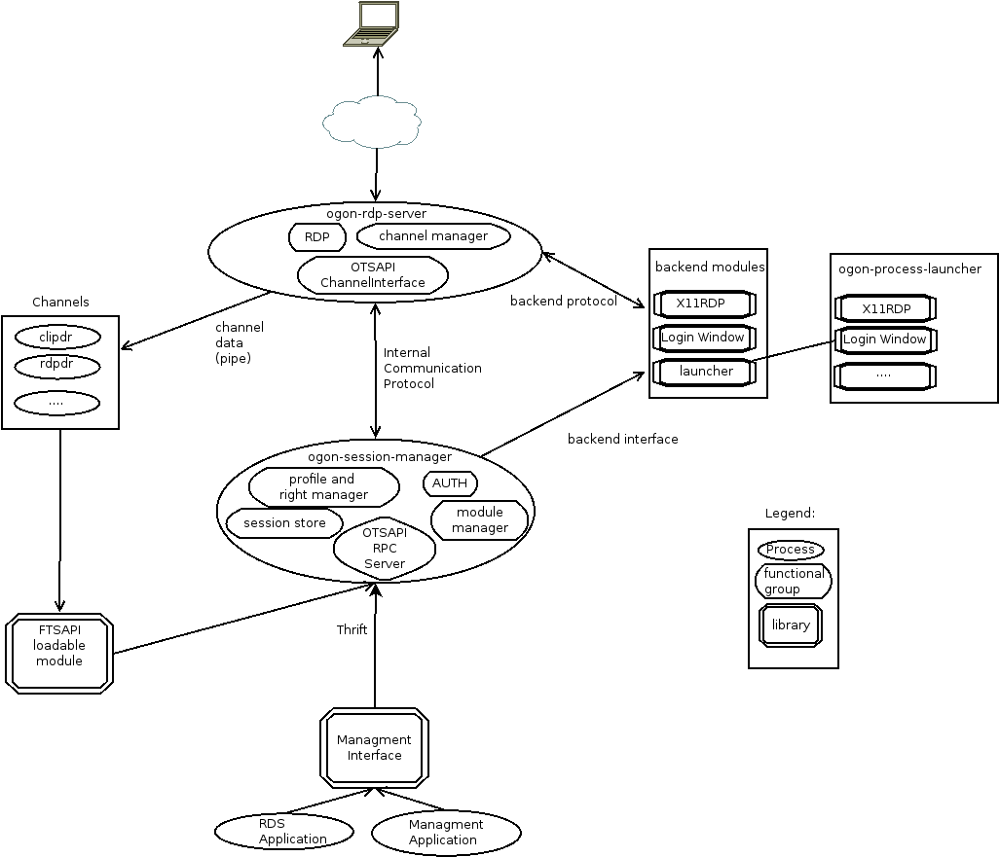
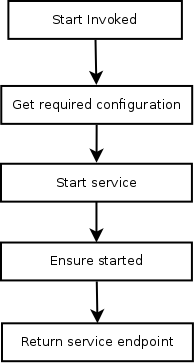

# Terminology
* ogon - the name of the complete infrastructure/stack
* ogon RDP Server (RDS) - Process that communicates with the client over the RDP protocol
* Connection - Connection to RDS over RDP. A connection has a connected session
* Session - Started service bound to a specific user context (creator). Session can have multiple connections (shadowing)
* Module - Shared library that is loaded by ogon Session Manager to start a Backend
* Backend -  Out of process part of a Module that is started by the Module connector (e.g. X11, Weston/Wayland, Qt, ...) that implements the backend protocol
* ogon Session Manager - The ogon Session Manager main task is to start and stop sessions as well as keep records and session information
* OTSAPI - RPC based implementation of the Microsoft [WTSAPI] that is implemented in different parts of ogon
* Endpoint - Named pipe corresponding to a Backend

# Naming

# Abbreviations
* VC - Virtual channel
* ICP - Internal communication protocol
* PBRCP - Protocol buffer RPC
* SBP - ogon Session Manager to backend protocol

# Architecture


The overall architecture of ogon consists of two processes: ogon RDP server and the ogon session manager. These two processes exchange data over an internal communication protocol (ICP).

## ogon session manager
The ogon session manager's main task is to start and stop sessions as well as keep records and session information.
Tasks:

* Handles modules (loading, enumerating)
* Store session information (persistence)
* Session handling (launching/stopping)
* Manages and handles user permissions and profiles
* Provider for ogon SDK API (OTSAPI) to applications (RPC)
* Handles authentication

## RDP server
Is a process that communicates with the client over the RDP protocol.
Components and tasks:

* Communicates with a backend via the backend protocol and talks RDP to a client


## OTSAPI (WTSAPI) channel interface
ogon implements the channel functionality of the Microsoft [WTSAPI].
Channels themselves can be standalone processes or threads which communicate over OTSAPI.
In the regular case (e.g. clipboard in a X session) the VC communicates over the loadable WTSAPI with the ogon Session Manager which in turn "routes" the messages to ogon RDP Server where they get handled.

For required or convenience extensions (thinking of MS-RDPEECO) the ogon RDP Server can load the channel itself (e.g. as thread). In this case the channel interface is invoked directly instead of using the RPC mechanism.

### WTSAPI Calls
The following OTSAPI calls are implemented in RDS required for channels.

* WTSVirtualChannelClose
* WTSVirtualChannelOpen
* WTSVirtualChannelOpenEx
* WTSVirtualChannelQuery
* WTSVirtualChannelRead
* WTSVirtualChannelWrite

### Channel example for ogon-backend-x

The following process list shows examples for server side channels within a
X backend session:

* ogon Session Manager
 * ogon-backend-x
 * X11Session
   * rdpclip
   * rdpdr

Since channels are stateless they need to be reinitalized/restarted after a client disconnected and connected again.

## Backend module(s)
A backend module consists basically of:

* a shared library that is loaded by the ogon Session Manager
* "glue code" that is able to start/stop/free/create a backend service
* an out of process part of a module implementing the backend  protocol (e.g. the ogon weston application or the ogon X11 server binary)

By example: The X11 backend module would have the functionality to start everything required for ogon-backend-x (server, window manager, ...) and pass the backend pipe name back to ogon Session Manager which in turn passes it to the ogon RDP Server. The "backend service" would be provided by ogon-backend-x which implements the backend protocol.

### Interface
The shared library needs to provide an entry point function called "RdsModuleEntry" which is called after the library containing the module was opened.
```c
typedef int (*pRdsModuleEntry)(RDS_MODULE_ENTRY_POINTS* pEntryPoints);
```
The entry function sets all required entry points for that module:
```c
    DWORD Version;         // version of the module (API version of the module)

    pRdsModuleNew New;     // function to create a new backend service
    pRdsModuleFree Free;   // function to free a backend service created with New

    pRdsModuleStart Start; // start a backend service
    pRdsModuleStop Stop;   // stop a backend service
    char* Name;            // name of the service
```
It will also set a pointer to property functions that can be used by the module to receive configuration parameters from the property manager.
The start function is run as priviledged (root) user so that it is possible to switch to a defined user before starting the service (if required) and returns the name of the backend service endpoint (where RDS should connect to).



The start of a backend is illustrated above. Start is invoked on the module which in turn queries all required settings over the provided property functions, starts the backend service itself, ensures that the backend is started (module specific) and passes back the backend endpoint (named pipe) to the caller.

### Module protocol
Needs:
* disconnect
* mouse input
* keyboard input
* display output


## Internal communication protocol (ICP)

For the internal communcation protocol Google protocol buffers (protobuf) is used for serialization.
Since protobuf doesn't provide a *compatible* RPC implementation for different languages which also support bidirectional RPC (over one socket) this needed to be implemented (pbRPC).
The protocol itself is kept simple. The wire format consists of two fields:
* 32 bit length (in network byte order)
* serialized pbRPC message

The pbRPC message is the basic transmission unit for RPC messages (in both directions) and includes:
* Tag - to uniquely identify a request/response
* Response - a field to set if the message is a response to a call
* Status - status of the call (set to SUCCESS in case of a request)
* Message type - type of the containing request/response
* Payload - serialized protocol buffer message containing the request/response itself

With the fields `response` and `message type` one can identify the type of a message that is contained in payload and if its a request or response (if response is set to true it's a response)
The tag field must be used to identify the corresponding response for a request.
One basic rule for pbRPC is that *every* message must be responded to.


[WTSAPI]:https://msdn.microsoft.com/en-us/library/aa383464%28v=vs.85%29.aspx
